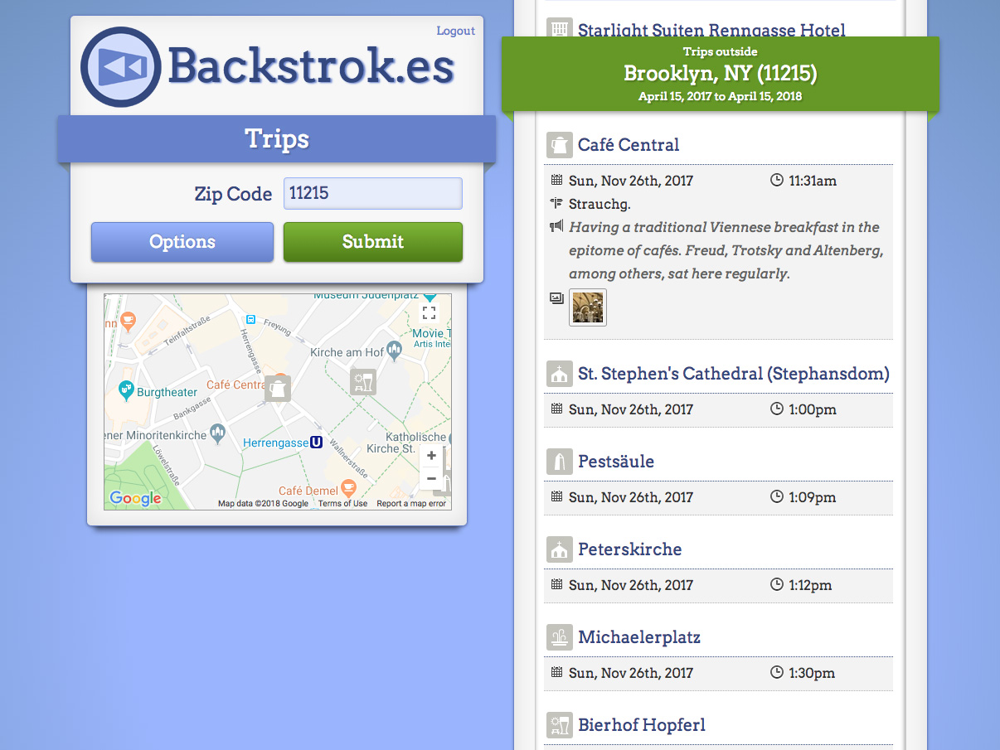
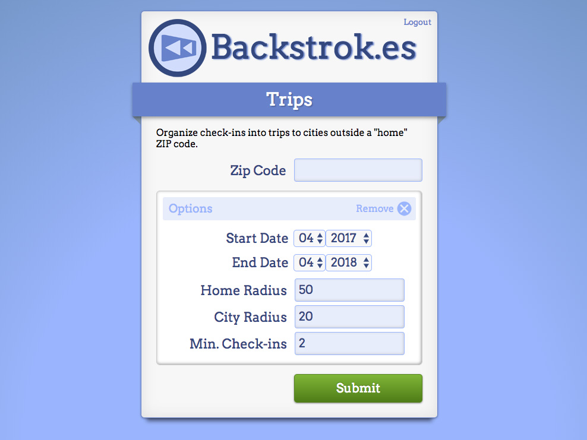
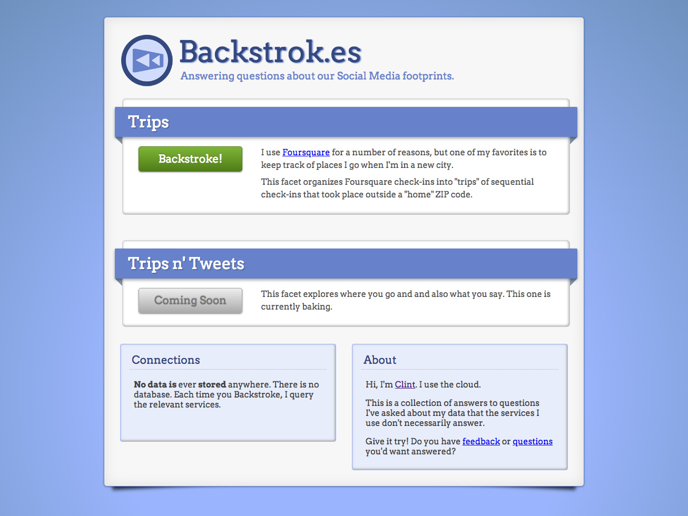

# Background

I attended [SxSW](http://www.sxsw.com/) in 2010, for the third time. As always,
there were a ton of things to see and do... but I found myself remembering
places from past trips to Austin. Things like:

- "where was that one place we went on Friday last year, with the **\_\_\_\_**
- and the **\_\_\_\_**? Did we go to the **\_\_\_\_**-sponsored talk last time?
- Where was that awesome restaurant where we met **\_\_\_\_**?"

With FOMO on my mind, those questions inevitably got answered, usually after a
lot of painful searching through memory, anecdote, blog and social media.

One night of the conference, I was wandering through Austin (keeping a weather
eye open for my next awesome experience), when I saw a _very_ large group
gathering in the lobby of the Hilton.

I checked my Twitter feed, and I saw [Dennis Crowley](http://denniscrowley.com/)
of Foursquare had been tweeting
[cryptic](http://www.twitter.com/dens/status/47559270732009472)
[messages](http://www.twitter.com/dens/status/47539944884932609) hinting toward
some kind of "swimming" event.

I discovered that, every year at SxSW, the Foursquare guys would lie on their
backs and race across the lobby floor pushing with their feet and a making a
backstroking motion with their arms. It was hilarious.

Inspired by the shenanigans, I decided I would build a "memory" tool for social
media, and I would call it "Backstrokes"... allowing people to "swim back"
through their history.

# The Project

[Backstrok.es](http://backstrok.es/) currently has one facet, the one that was
the most interesting to me at the time: trips to other cities. Using a home zip
code, Backstrok.es will organize checkins within a certain range of each other
into "trips", making it easy to list and recall the places you’ve been.

The code is now [open-source](https://github.com/clintandrewhall/backstrok.es)
on [my Github](https://github.com/clintandrewhall).  I update it as I have time.

# Colophon

Backstrok.es is built on Node.JS. It uses my
[node-foursquare](http://www.clintandrewhall.com/portfolio/node-foursquare)
library for working with the Swarm and Foursquare APIs. As a point of pride (and
to keep the hosting free), it uses no database: all data is retrieved and
organized on each page load.

Perhaps in the future I’ll use a database for "sharing" trips with your friends.
But for now, it's a useful tool when friends of mine are looking for
recommendations in cities I've visited.
