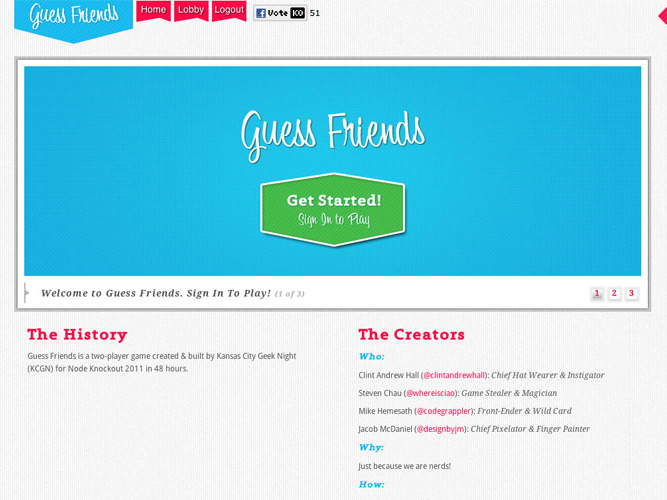
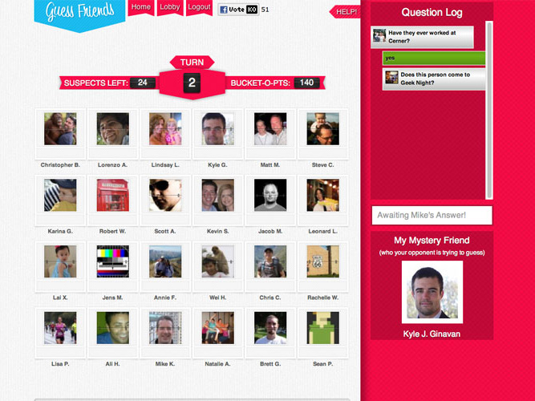
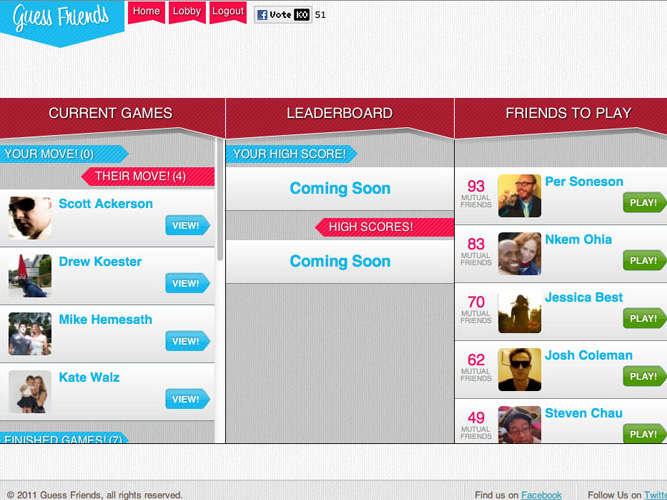
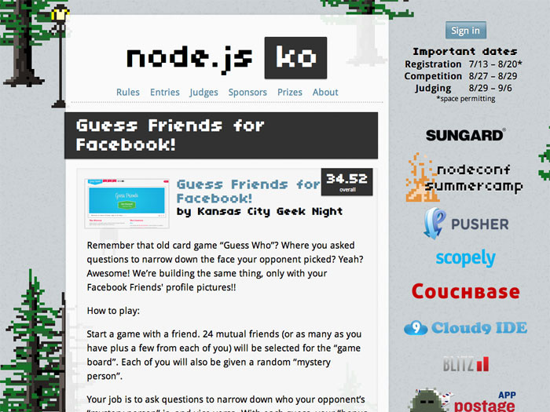

---
cover:
  src: './guess-friends-2.jpg'
  size: '667x500'
slug: 'guess-friends'
caption: 'Guess Friends was a website a few friends and I wrote for the first Node Knockout.'
tags:
  [
    { name: 'NodeJS', slug: 'node' },
    { name: 'Node Knockout', slug: 'node-knockout' },
  ]
timestamp: 1313020800
title: 'Guess Friends'
---

# Background

In 2010, I signed up for the first annual [Node
Knockout](http://www.nodeknockout.com/), a 48-hour coding competition where
teams of up to 4 people could create any app they wanted on the Node.JS server.
It was a lot of fun, and I learned *a lot* about Node… but we definitely bit off
more than we could chew. With lessons learned and more time in the Node world, I
was raring to go for Node Knockout 2011.

I recruited what my friends called a "[Dream
Team](http://www.twitter.com/clintandrewhall/status/107130172192473088)" of
geeks: designer [Jacob McDaniel](http://www.twitter.com/designbyjm) and
developers [Steven Chau](http://www.twitter.com/whereisciao) and [Mike
Hemesath](http://www.twitter.com/codegrappler). After many Monday Geek Night
hashing out what we would build, we decided on a classic childhood game that had
yet to be recreated in the social media space: [Guess
Who](http://www.hasbro.com/games/en_US/guess-who/).

# Implementation

We knew from talking to our friends and fellow geeks that using mutual Facebook
friends as the “tiles” would give us the greatest traction, (and the most fun
gaming experience). We also decided to use [Pusher](http://www.pusher.com/) to
give it some async love. Jacob tackled the user experience and I took on most of
the core experience code. Mike and Steven took on the new Pusher API and some of
the custom Connect middleware. Mike also served as our deployment ninja, keeping
our Heroku instance healthy and happy. Steven even got a custom cache out on
Amazon for the Facebook images.

# Results

In the end, [our entry](http://nodeknockout.com/teams/kansas-city-geek-nig)
ended up in the top 10% of entries in [all
categories](http://nodeknockout.com/entries). Judges and users alike loved the
design and concept, and our friends were delighted to play. Had we had more
time, we could have gotten a lot more done: notifications, mobile, invites, etc.
We’re still planning some enhancements, (as soon as we have some time, that is!)
